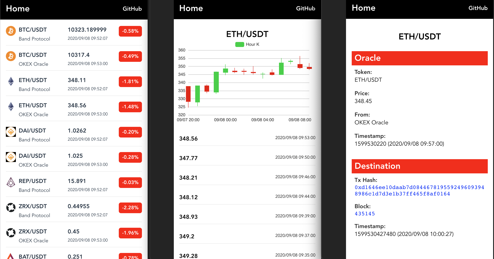

# CKB Oracle Bridge

[](https://github.com/duanyytop/ckb-oracle-bridge/blob/master/LICENSE)
[](https://github.com/duanyytop/ckb-oracle-bridge/actions)
[](https://t.me/nervos_ckb_dev)

[Live Demo](https://oracle-bridge.ckbapp.dev/)

CKB Oracle Bridge is an oracle bridge fetching the oracle data of [Band Protocol](https://bandprotocol.com/) and [Open Oracle](https://github.com/compound-finance/open-oracle)(e.g. [Okex oracle](https://www.okex.com/docs/en/#oracle-oracle) and [Coinbase oracle](https://docs.pro.coinbase.com/#oracle)) from Nervos CKB and displaying oracle data with web pages.

The Band Protocol oracle data of Nervos CKB is posted by [`ckb-band-oracle`](https://github.com/duanyytop/ckb-band-oracle) and the Open Oracle data is poster by [`ckb-open-oracle`](https://github.com/duanyytop/ckb-open-oracle)(Okex Oracle has been supported).

CKB Oracle Bridge includes two parts: server and client.

### Server

Server is a web server (Node.js) to fetch, decode and store the oracle data of Band Protocol and Open Oracle from Nervos CKB and provide http api to client.

Before starting server, ckb node is needed whose websocket is enabled. Then ckb transactions containing oracle data are fetched, filtered and decoded from ckb node with [ckb-lumos](https://github.com/nervosnetwork/lumos) and http api is provided to client

### Client

Client is a web application(Vue.js) rendering oracle data which comes from server part. Client includes three pages: latest price list page, token price history page and token detail page.



### Prerequisites

- CKB Node ([CKB websocket](https://github.com/nervosnetwork/ckb/wiki/RPC-subscription) is enabled)
- Node.js 12+

### Getting Started

```shell
$ git clone https://github.com/duanyytop/ckb-oracle-bridge
$ cd ckb-oracle-bridge
$ yarn bootstrap
```

Update `CKB_NODE_URL` and `CKB_WEBSOCKET_URL` for `server/.env` file which can be copied from `server/.env.example`

Update `VUE_APP_SERVER_URL` with server url for `client/.env` file which can be copied from `client/.env.example`

```shell
$ yarn start:server
$ yarn start:client

# build for client production
$ yarn build:client
```

> Note: Server need a while to indexer ckb transactions which contain oracle data and put data to database, so client should wait a moment to start after server completing indexer.

### Resource

- [Band Protocol](https://bandprotocol.com/) - A cross-chain data oracle platform that aggregates and connects real-world data and APIs to smart contracts
- [Open Oracle](https://github.com/compound-finance/open-oracle) - A standard and SDK allowing reporters to sign key-value pairs (e.g. a price feed) that interested users can post to the blockchain
- [CKB JavaScript SDK](https://github.com/nervosnetwork/ckb-sdk-js) - JavaScript SDK of Nervos CKB which can help developers to interact ckb node
- [CKB Lumos](https://github.com/nervosnetwork/lumos) - A full featured dapp framework for Nervos CKB
- [CKB Explorer](https://explorer.nervos.org) - CKB blockchain explorer
